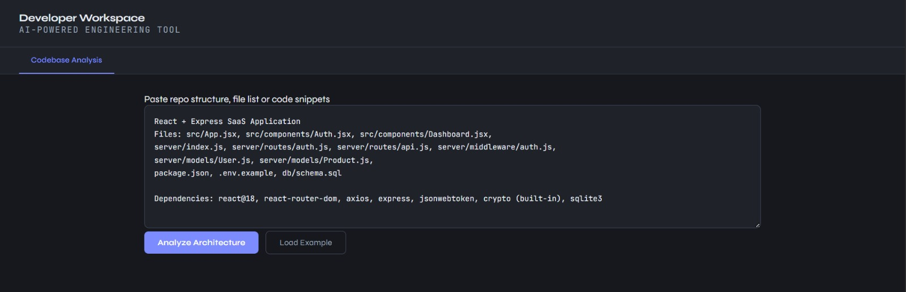
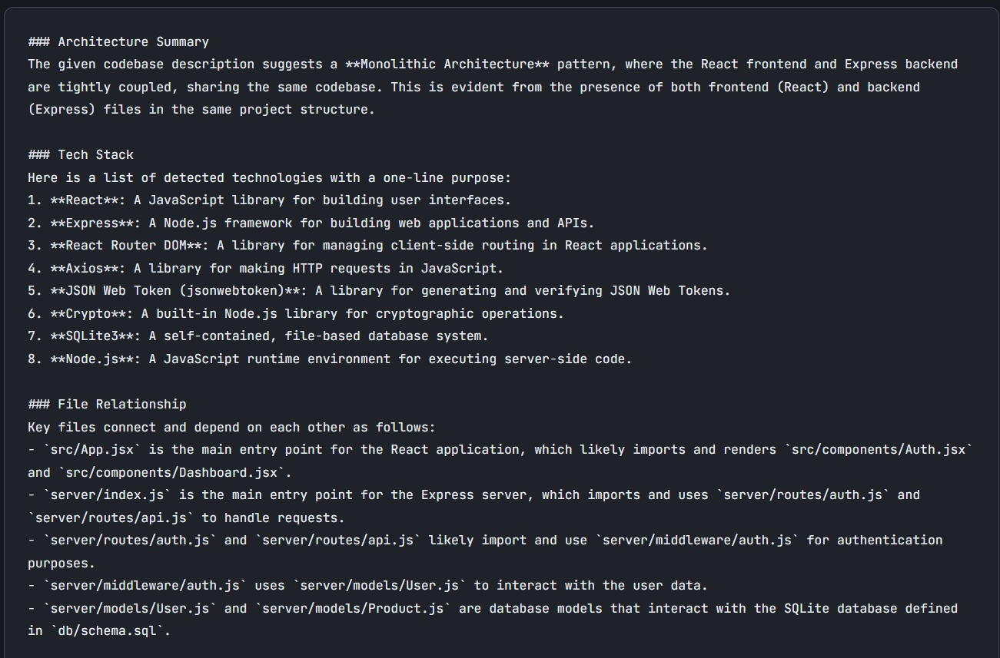
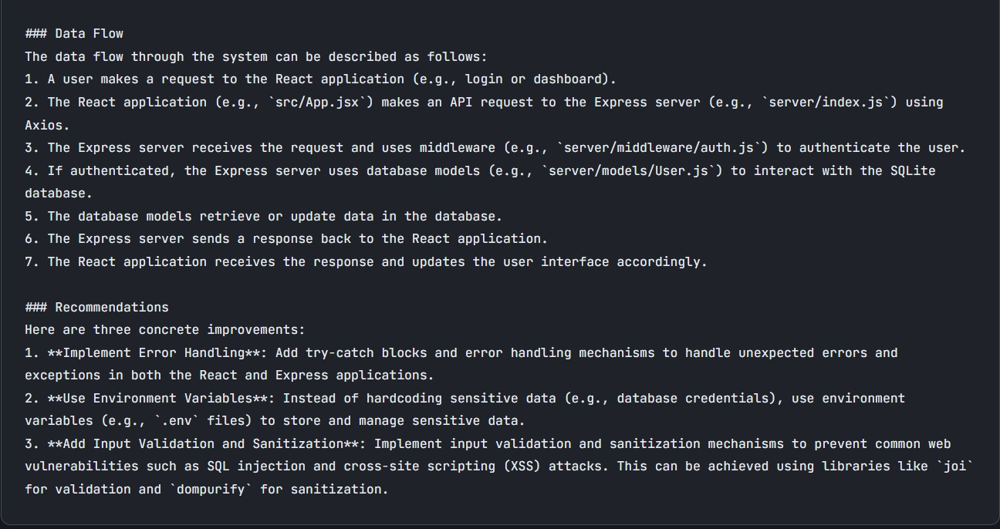

# AI Developer Workspace

An AI-powered engineering assistant built for developers to analyze software architecture, inspect codebases, and generate intelligent technical insights.

This project aims to become a complete developer workspace capable of:
- codebase analysis,
- PR reviews,
- debugging assistance,
- vulnerability scanning,
- and documentation generation.

Currently implemented:
- ✅ Codebase Analysis Engine

Planned:
- 🚧 Bug Detector
- 🚧 PR Review Assistant
- 🚧 Documentation Generator
- 🚧 Vulnerability Scanner

---

# Preview

## Main Workspace

## Architecture Analysis

## Data Flow + Recommendations

---

# Features

## ✅ Codebase Analysis

The current implementation analyzes:
- software architecture patterns,
- detected technologies,
- file relationships,
- request/data flow,
- engineering recommendations.

The AI behaves like a senior software architect and produces structured engineering insights.

### Example Capabilities

- Detect MVC/monolith architecture
- Understand frontend/backend separation
- Explain file dependencies
- Analyze request-response lifecycle
- Suggest scalability improvements
- Recommend security best practices

---

# Planned Features

## 🚧 Bug Detector

User pastes:
- stack traces,
- runtime errors,
- logs,
- console output.

The AI will:
- identify root causes,
- explain failures,
- suggest fixes,
- recommend prevention strategies.

---

## 🚧 PR Review Assistant

Upload:
- git diffs,
- pull requests,
- changed files.

The AI will review:
- security issues,
- code quality,
- logic bugs,
- edge cases,
- missing tests,
- performance concerns.

---

## 🚧 Documentation Generator

Generate:
- README files,
- API documentation,
- onboarding guides,
- JSDoc comments.

---

## 🚧 Vulnerability Scanner

Analyze source code for:
- SQL injection,
- auth flaws,
- exposed secrets,
- insecure patterns,
- OWASP Top 10 vulnerabilities.

---

# Tech Stack

## Frontend

- React
- Vite
- JavaScript
- CSS

## AI Integration

- Groq API
- Llama 3.3 70B

## Planned Backend

- Node.js
- Express/Fastify

---

# Future Improvements

Planned improvements include:
- real repository upload support,
- GitHub integration,
- streaming AI responses,
- authentication,
- persistent workspace history,
- syntax-highlighted outputs,
- markdown rendering,
- backend proxy for API security,
- multi-model AI selection.

---

# Security Note

Currently the AI API is called directly from the frontend for development/demo purposes.

Production architecture should move AI requests to a backend service to protect API keys.

---

# Inspiration

Inspired by modern AI engineering tools like:
- Cursor
- Linear
- GitHub Copilot
- Raycast
- Sourcegraph Cody

---

# Author

### Yashika Khandelwal

GitHub:
https://github.com/k-Yashika

LinkedIn:
https://www.linkedin.com/in/k-yashika/
